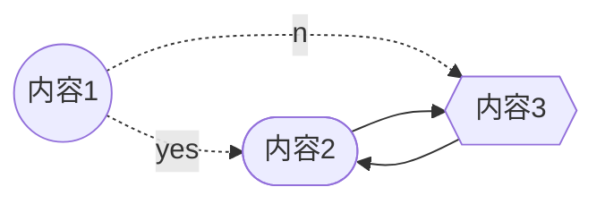
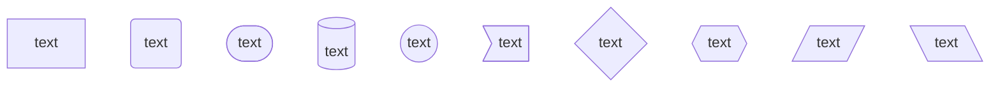
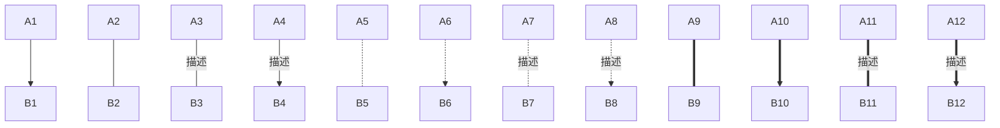
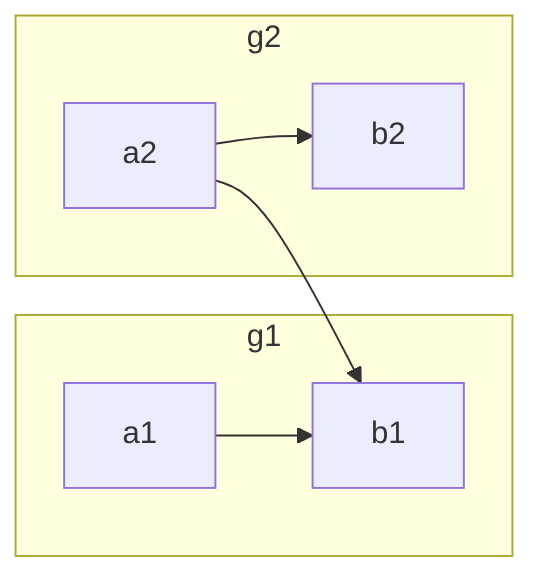
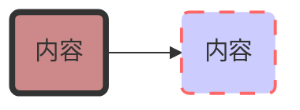
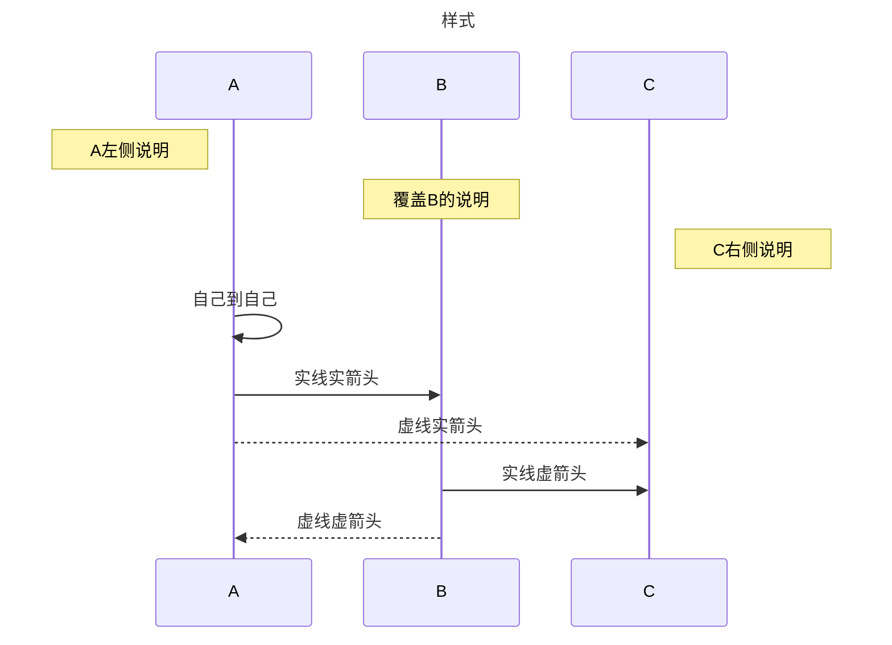
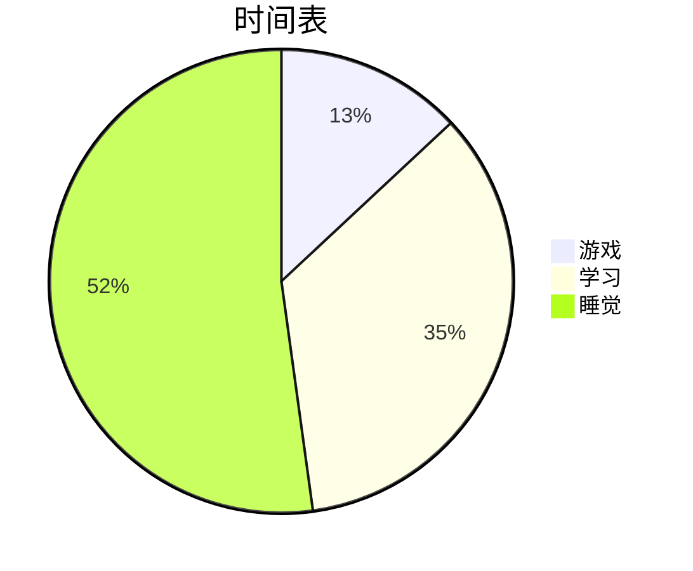

# MarkDown笔记

[toc]


### 一、排版相关

##### 1.标题

\#一级标题 
\##二级标题
\###三级标题
\####四级标题
\#####五级标题
\######六级标题

##### 2.换行

代码区域自动换行，段落的换行是使用两个以上空格加上回车

末尾通过`\\`来强制换行

##### 3.强调

使用\*或者\_来强调

+ \*代码\*，*样式*
+ \*\*代码\*\*，**样式**
+ \*\*\*代码\*\*\*，***样式***
+ \_代码\_，_样式_
+ \_\_代码\_\_，__样式__
+ \_\_\_代码\_\_\_，___样式___

##### 4.分隔线

三个以上的星、减、下划线来建立分隔线，行内不能有其他东西

##### 5.删除线

在文字的两端加上两个波浪线~~

+ \~\~代码\~\~，~~样式~~

##### 6.下划线

使用\<u>\</u>

+ \<u>代码\</u>，<u>样式</u>

##### 7.脚注

主要内容\[^变量名] 和\[^变量名]:脚注内容

+ 样式脚注[^a] 

  [^a]: 脚注内容


##### 8.列表

无序列表使用星、加或是减作为标记，标记后要加空格，然后填写内容
有序列表直接1.、2.(数字加点)

+ \+ 代码 ,样式（本行即是无序列表样式）
+ \- 代码 ,样式（本行即是无序列表样式）
+ \* 代码 ,样式（本行即是无序列表样式）
  + 列表嵌套：在子列表中符号前前面添加两个或四个空格  
    例如：
      \+ 上级列表  
        $~~$ \*下级列表   

##### 9.加空格

\$~~~$,波浪线数量代表空格数量空格

##### 10.区块

在段落开头使用>符号 ，后面紧跟一个空格符号,嵌套就多个>

> \>区块

>> \>嵌套区块

$~~~~~~~~~~~~~~~$*注：1.如果想嵌套多个 >是嵌套完再加空格*
$~~~~~~~~~~~~~~~~~~~~~~$*2.如果区块要分开就多空一行（再回车一次）*

##### 11.对齐方式

使用代码`<div align="center">内容</div>`,居中:center,靠左:left,靠右:right

- <div align=left>靠左</div>

- <div align=center>居中</div>

- <div align=right>靠右</div>

##### 12.高亮

用\==内容==表示

+ ==样式==

##### 13.代码

用\`表示（1至3个\`形成代码块）

\``内容\``  `样式`  \```内容\```  ```样式```

##### 14.超链接

+ 普通超链接：用\[]()表示
  + \[命名]\(网址)  [样式（点击这下载Typora破解版）](https://zhuanlan.zhihu.com/p/628570727)
+ 高级超链接：用 1 作为网址变量 \[命名][变量名]结尾为变量赋值[变量名]：网址
  + \[样式][1]
  + \[1]:https://www.bilibili.com/

##### 15.转义符

有很多特殊符号来表示特定的意义，如果需要显示特定的符号则需要使用`\`转义

+ 正常的\*带星号* 是*这样的*
  + 加了`\`后\\\*带星号* 就成了\*这样的*

##### 16.颜色

| 预期     | 效果                                                         | 代码规则                                                     |
| -------- | ------------------------------------------------------------ | ------------------------------------------------------------ |
| 字体颜色 | $\textcolor{#fbceb1}{文字内容}$                              | `$\textcolor{#十六进制颜色值}{文字内容}$`或者`$\color{#GRB号}{内容}$` |
| HTML法   | <font color='#1AA673'>文字内容</font>                        | `<font color='#十六进制颜色值'>文字内容</font>`              |
| 字框颜色 | $\colorbox{#008E51}{\textcolor{#73FFFB}{文字内容}}$          | `$\colorbox{#十六进制颜色值}{\textcolor{#GRB号}{文字内容}}$` |
| HTML法   | <font style="background:#E428E4">文字内容</font>             | `<font style="background:#E428E4">文字内容</font>`           |
| 边框     | $\color{#73FFFB}\boxed{\color{#fbceb1}{内容}}$               | `$\color{#十六进制颜色值(框)}\boxed{\color{#十六进制颜色值(文)}{内容}}$` |
| 公式颜色 | $\color{#99CCFF}\begin{vmatrix}a&b\\c&d\end{vmatrix}$        | `$\color{#十六进制颜色值}\begin{vmatrix}a&b\\c&d\end{vmatrix}$` |
| 渐变色   | <font style="background:linear-gradient(to right,#99CCFF,#fbceb1,#008E51)">背景效果</font> | `<font style="background:linear-gradient(to right,#色1,#色2...)">背景效果</font>` |


##### 17.字体

默认体：$\textnormal{ABCdef123}$     代码：`$\textnormal{ABCdef123}$`
罗马体：$\rm{ABCdef123}$     代码：`$\rm{ABCdef123}$`
双重体：$\mathbb{ABCdef123}$     代码：`$\mathbb{ABCdef123}$`
意斜体：$\textit{ABCdef123}$     代码：`$\textit{ABCdef123}$`
无线体：$\textsf{ABCdef123}$     代码：`$\textsf{ABCdef123}$ `
粗斜体：$\boldsymbol{ABCdef123}$     代码：`$\boldsymbol{ABCdef123}$`
机械体：$\texttt{ABCdef123}$     代码：`$\texttt{ABCdef123}$`
书写体：$\mathcal{ABCdef123}$     代码：`$\mathcal{ABCdef123}$`
哥特体：$\mathfrak{ABCdef123}$     代码：`$\mathfrak{ABCdef123}$`

##### 18.字体大小

| 效果             | 代码               |
| ---------------- | ------------------ |
| $\Huge AB$       | `$\Huge AB$`       |
| $\huge AB$       | `$\huge AB$`       |
| $\LARGE AB$      | `$\LARGE AB$`      |
| $\Large AB$      | `$\Large AB$`      |
| $\large AB$      | `$\large AB$`      |
| $\normalsize AB$ | `$\normalsize AB$` |
| $\small AB$      | `$\small AB$`      |
| $\scriptsize AB$ | `$\scriptsize AB$` |
| $\tiny AB$       | `$\tiny AB$`       |


##### 19.布局

标注符号：
$\cancel{ABC}$   代码：`$\cancel{ABC}$`
$\bcancel{ABC}$   代码：`$\bcancel{ABC}$`
$\xcancel{ABC}$   代码：`$\xcancel{ABC}$`

$\overbrace{a+b+c}^{\text{note}}$   代码：`$\overbrace{a+b+c}^{\text{note}}$`
$\underbrace{a+b+c}_{\text{note}}$   代码：`$\underbrace{a+b+c}_{\text{note}}$`

##### 20.注释

在代码内容前加上%会转移成注释

##### 21.锚点跳转

`[名称](#变量名)`定义链接位置

`<span id="变量名"></span>`定义跳转位置


### 二、数学相关

#### A.公式排版

##### 1.对齐

通过\begin{align}<内容>\end{align}实现等号对齐

算式前加`&`实现左对齐

+ \begin{align}

  &x^2+y=4

  &x^2+y^2+k=23

  \end{align}
  $$
  效果：
  \begin{align}
  &x^2+y=4\\
  &x^2+y^2+k=23
  \end{align}~~~~~~~~~~~~~~~~~~~~~~~~~~~~~~~~~~~~~~~~~~~~~~~~~~~~~~~~~~~~~~~~~~~~~~~~~~~~~~~~~~~~~~~~~~~~~~~~~~~~~~~~~~~~~~~~~~~~~~~~~~
  $$


#### B.公式代码

##### 1.用\$作为公式命令块

+ \$\$...\$\$表示块内公式(使用代码\$\$\sum_{i=1}^{\infin}$$)

  + $$
    \sum_{i=1}^{\infin}
    $$

+ \$...\$表示行内公式(使用代码\$\sum_{i=1}^{\infin}$)

  + $\sum_{i=1}^{\infin}$

##### 2.公式编号

+ 在块内公式用`$\tag{编号}$`，在公式前在后不影响效果
样式：
$$
\tag{I}AB\not=BA
$$

##### 3.垂直布局

| 效果                        | 代码                                             |
| :-------------------------- | ------------------------------------------------ |
| $x_n$                       | `$x_n$`                                          |
| $e^x$                       | `$e^x$`                                          |
| $a \atop b$                 | `$a \atop b$`或者`$_b^a$`或者`$\underset{b}{a}$` |
| $\underset{b}{\rightarrow}$ | `$\underset{b}{\rightarrow}$`                    |
| $\overset{a}{\rightarrow}$  | `$\overset{a}{\rightarrow}$`                     |


##### 4.矩阵与行列式

| 名称          | 效果                                          | 代码                                            |
| ------------- | --------------------------------------------- | ----------------------------------------------- |
|               | $\begin{matrix}a & b \\c & d\end{matrix}$     | `$\begin{matrix}a & b \\c & d\end{matrix}$`     |
| 行列式        | $\begin{vmatrix}a & b \\c & d\end{vmatrix}$   | `$\begin{vmatrix}a & b \\c & d\end{vmatrix}$`   |
| 方括号        | $\begin{bmatrix}a & b \\c & d\end{bmatrix}$   | `$\begin{bmatrix}a & b \\c & d\end{bmatrix}$`   |
| 圆括号        | $\begin{pmatrix}a & b \\c & d\end{pmatrix}$   | `$\begin{pmatrix}a & b \\c & d\end{pmatrix}$`   |
| 花括号        | $\begin{Bmatrix}a & b \\c & d\end{Bmatrix}$   | `$\begin{Bmatrix}a & b \\c & d\end{Bmatrix}$`   |
| 范数          | $\begin{Vmatrix} a&b\\c&d\end{Vmatrix}$       | `$\begin{Vmatrix}a & b \\c & d\end{Vmatrix}$`   |
| 并齐等号（&） | $\begin{aligned}a&=b+c \\f&=c+a\end{aligned}$ | `$\begin{aligned}a&=b+c \\f&=c+a\end{aligned}$` |
| 多项式        | $\begin{cases}a+b=2\\a-b=1\end{cases}$        | `$\begin{cases}a+b=2\\a-b=1\end{cases}$`        |

##### 5.希腊字母

大写希腊字母

| 效果     | 代码      | 效果    | 代码     | 效果     | 代码      |
| :------- | --------- | ------- | -------- | -------- | :-------- |
| $\Alpha$ | `$\Alpha$` | $\Beta$ | `$\Beta$` |$\Gamma$|`$\Gamma$`|
| $\Delta$ | `$\Delta$` | $\Epsilon$ | `$\Epsilon$` | $\Zeta$ | `$\Zeta$` |
| $\Eta$ | `$\Eta$` | $\Theta$ | `$\Theta$` | $\Lambda$ | `$\Lambda$` |
| $\Pi$ | `$\Pi$` | $\Rho$ | `$\Rho$` | $\Sigma$ | `$\Sigma$` |
| $\Tau$ | `$\Tau$` | $\Phi$ | `$\Phi$` | $\Omega$ | `$\Omega$` |

小写希腊字母：

| 效果      | 代码       | 效果     | 代码      | 效果      | 代码       |
| --------- | ---------- | -------- | --------- | --------- | ---------- |
| $\alpha$  | `$\alpha$`  | $\beta$  | `$\beta$` | $\gamma$  | `$\gamma$`  |||
| $\delta$  | `$\delta$ ` | $\eta$   | `$\eta$ `  | $\theta$  | `$\theta$`  |||
| $\iota$   | `$\iota$  ` | $\kappa$ | `$\kappa$` | $\lambda$ | `$\lambda$ `|||
| $\sigma$  | `$\sigma$ ` | $\xi$    | `$\xi$  `  | $\pi$     | `$\pi$ `    |||
| $\phi$    |` $\phi$  `  | $\psi$   |` $\psi$ `  | $\omega$  | `$\omega$ ` |||
| $\varphi$ | `$\varphi$` | $\rho$   |` $\rho$  ` | $\mu$     | `$\mu$  `   |||

##### 6.逻辑与集合论符号

| 效果              | 代码              | 效果          | 代码          | 效果          | 代码            |
| ----------------- | ----------------- | ------------- | ------------- | ------------- | --------------- |
| $\forall$         | `$\forall$ `        | $\complement$ | `$\complement$` | $\empty$      | `$\empty$ `       |
| $\therefore$      | `$\therefore$  `    | $\because$    |`$\because$ `   | $\varnothing$ |` $\varnothing$   `|
| $\subset$         | `$\subset$    `     | $\supset$     | `$\supset$ `    | $\mid$        | `$\mid$   `       |
| $\exist$          | `$\exist$`          | $\nexists$    | `$\nexists$ `   | $\to$         | `$\to$ `          |
| $\land$           |` $\land$`           | $\lor$        |` $\lor$`        | $\gets$       | `$\gets$  `       |
| $\in$             |` $\in$ `            | $\ni$         |` $\ni$ `        | $\implies$    | `$\implies$`      |
| $\notin$          | `$\notin$ `         | $\not\ni$     |` $\not\ni$  `   | $\impliedby$  | `$\impliedby$ `   |
| $\leftrightarrow$ | `$\leftrightarrow$ `| $\iff$        |` $\iff$ `       | $\neg$        | `$\neg$或$\lnot$` |

##### 7.运算符

运算符

| 效果                | 代码                  | 效果           | 代码             | 效果          | 代码            |
| ------------------- | --------------------- | -------------- | ---------------- | ------------- | --------------- |
| $\intercal$         | `$\intercal$`         | $\cap$         | `$\cap$`         | $\cup$        | `$\cup$`        |
| $\pm$               | `$\pm$`               | $\mp$          | `$\mp$`          | $\cdot$       | `$\cdot$`       |
| $\times$            | `$\times$`            | $\div$         | `$\div$`         | $\bullet$     | `$\bullet$`     |
| $\frac{a}{b}$       | `$\frac{a}{b}$`       | $\dfrac{a}{b}$ | `$\dfrac{a}{b}$` | ${a\brack b}$ | `${a\brack b}$` |
| ${a \above{2pt} b}$ | `${a \above{2pt} b}$` | ${n\choose k}$ | `${n\choose k}$` | ${n\brace k}$ | `${n\brace k}$` |

关系运算符（不等加\not，$\not\approx$`$\not\approx$`）

| 效果        | 代码          | 效果        | 代码          | 效果         | 代码           |
| ----------- | ------------- | ----------- | ------------- | ------------ | -------------- |
| $\approx$   | `$\approx$`   | $\equiv$    | `$\equiv$`    | $\times$     | `$\times$`     |
| $\sub$      | `$\sub$`      | $\sube$     | `$\sube$`     | $\subseteqq$ | `$\subseteqq$` |
| $\supset$   | `$\supset$`   | $\supe$     | `$\supe$`     | $\supseteqq$ | `$\supseteqq$` |
| $\geqslant$ | `$\geqslant$` | $\leqslant$ | `$\leqslant$` | $\triangle$  | `$\triangle$`  |

巨符号（积分求和等）

| 效果         | 代码         | 效果        | 代码        | 效果       | 代码       |
| ------------ | ------------ | ----------- | ----------- | ---------- | ---------- |
| $\sum$       | `$\sum$ `      | $\prod$     | `$\prod$`     | $\coprod$  | `$\coprod$`  |
| $\bigotimes$ | `$\bigotimes$` | $\bigoplus$ | `$\bigoplus$` | $\bigodot$ | `$\bigodot$` |
| $\int$       | `$\int$`       | $\iint$      | `$\iint$`      | $\iiint$     | `$\iiint$`     |
| $\oint$      | `$\oint`      | $\oiint$     | `$\oiint$`     | $\oiiint$    | `$\oiiint$`    |

箭头(加x和内容成为可扩展箭头 $\xrightarrow[under]{over}$：`$\rightarrow$`$\rightarrow$`$\xrightarrow[under]{over}$`)

| 效果               | 效果                 | 效果                  | 代码                    | 效果                  | 代码                    |
| ------------------ | -------------------- | --------------------- | ----------------------- | --------------------- | ----------------------- |
| $\rightarrow$      | `$\rightarrow$`      | $\leftarrow$          | `$\leftarrow$`          | $\leftrightarrow$     | `$\leftrightarrow$`     |
| $\Rightarrow$      | `$\Rightarrow$`      | $\Leftarrow$          | `$\Leftarrow$`          | $\Leftrightarrow$     | `$\Leftrightarrow$`     |
| $\leftrightarrows$ | `$\leftrightarrows$` | $\longleftrightarrow$ | `$\longleftrightarrow$` | $\Longleftrightarrow$ | `$\Longleftrightarrow$` |

上下标

| 效果                  | 代码                    | 效果                   | 代码                     | 效果              | 代码                |
| --------------------- | ----------------------- | ---------------------- | ------------------------ | ----------------- | ------------------- |
| $\underline{AB}$      | `$\underline{AB}$`      | $\overline{AB}$        | `$\overline{AB}$`        | $\vec{F}$         | `$\vec{F}$`         |
| $\underleftarrow{AB}$ | `$\underleftarrow{AB}$` | $\underrightarrow{AB}$ | `$\underrightarrow{AB}$` | $\overbrace{AB}$  | `$\overbrace{AB}$`  |
| $\overleftarrow{AB}$  | `$\overleftarrow{AB}$`  | $\overrightarrow{AB}$  | `$\overrightarrow{AB}$`  | $\underbrace{AB}$ | `$\underbrace{AB}$` |


##### 8.符号和标点符号

| 效果     | 代码       | 效果         | 代码           | 效果        | 代码          |
| -------- | ---------- | ------------ | -------------- | ----------- | ------------- |
| $\prime$ | `$\prime$` | $\backprime$ | `$\backprime$` | $\text{\S}$ | `$\text{\S}$` |
| $\angle$ | `$\angle$` | $\square$    | `$\square$`    | $\bot$      | `$\bot$`      |
| $\infin$ | `$\infin$` | $\checkmark$ | `$\checkmark$` | $\bigstar$  | `$\bigstar$`  |
| $\dots$  | `$\dots$`  | $\vdots$     | `$\vdots$`     | $\ddots$    | `$\ddots$`    |


### 三、操作相关

##### 1.分页操作

在需要分页的地方插入代码
`<div STYLE='page-break-after:always;'></div>`

##### 2.插入图片

在需要插入图片的地方输入代码，大小为百分数

``

+ 代码：\
  + 样式：

##### 3.表格

使用 **|** 来分隔不同的单元格，使用 **-** 来分隔表头和其他行

+ \| 表头 | 表头 |
  \| ---- | ---- |
  \|      |      |
  
  + | 表头 | 表头 |
    | ---- | ---- |
    |      |      |

+ **-:** 设置内容和标题栏居右对齐。

  **:-** 设置内容和标题栏居左对齐。

  **:-:** 设置内容和标题栏居中对齐。

  + 样式

    | 左对齐 | 右对齐 | 居中对齐 |
    | :-----| ----: | :----: |
    | 单元格 | 单元格 | 单元格 |
    | 单元格 | 单元格 | 单元格 |


##### 4.常用快捷键（Typora）

+ 加粗： `Ctrl + B`
+ 撤销： `Ctrl + Z`
+ 字体倾斜 ：`Ctrl+I`
+ 下划线：`Ctrl+U`
+ 多级标题： `Ctrl + 1~6`
+ 有序列表：`Ctrl + Shift + [`
+ 无序列表：`Ctrl + Shift + ]`
+ 降级快捷键 ：`Tab`
+ 升级快捷键：`Shift + Tab`
+ 插入链接： `Ctrl + K`
+ 插入公式： `Ctrl + Shift + M`
+ 行内代码： `Ctrl + Shift + K`
+ 插入图片： `Ctrl + Shift + I`
+ 返回Typora顶部：`Ctrl+Home`
+ 返回Typora底部 ：`Ctrl+End`
+ 创建表格 ：`Ctrl+T`
+ 选中某句话 ：`Ctrl+L`
+ 选中某个单词 ：`Ctrl+D`
+ 选中相同格式的文字 ：`Ctrl+E`
+ 搜索: `Ctrl+F`
+ 搜索并替换 ：`Ctrl+H`
+ 删除线 ：`Alt+Shift+5`
+ 引用 ：`Ctrl+Shift+Q`
+ 生成目录：`[TOC]+Enter`
+ 小空行：`Shift+Enter`

### 四、绘图相关

##### 1.待办事项

制作一个待办事项，`-[]` 表示未完成；`-[x]`表示已完成，但需要注意空格，形式是`-空格[空格]空格`

- [x] 支持以 PDF 格式导出
- [ ] 需要注意空格

##### 2.mermaid

###### 流程图

语法：

\```graph 方向;
    A((内容1));
    B([内容2]);
    C{{内容3}};
    A-.描述.->B;
    A-.描述.->C;
    B-->C;
    C-->B;




| 方向命令 | 方向     | 节点命令  |           |           |
| -------- | -------- | --------- | --------- | --------- |
| TB       | 从上到下 | A[text]   | E((text)) | I[/text/] |
| BT       | 从下到上 | B(text)   | F>text]   | J[\text]  |
| RL       | 从右到左 | C([text]) | G{text    |           |
| LR       | 从左到右 | D[(text)] | H{{text}} |           |

| 命令                | 形状             |
| ------------------- | ---------------- |
| A1 --> B1           | 箭头连接         |
| A2 --- B2           | 开放连接         |
| A3 -- 描述 --- B3   | 标签连接         |
| A4 -- 描述 --> B4   | 箭头标签连接     |
| A5 -.- B5           | 虚线开放连接     |
| A6 -.-> B6          | 虚线开放连接     |
| A7 -. 描述 .- B7    | 标签虚线连接     |
| A8 -. 描述 .-> B8   | 标签虚线箭头连接 |
| A9 === B9           | 粗线开放连接     |
| A10 ==> B10         | 粗线箭头连接     |
| A11 == 描述 === B11 | 标签粗线开放连接 |
| A12 == 描述 ==> B12 | 标签粗线箭头连接 |

子流程图：
语法：
\```graph 方向
  subgraph 变量名1
    a1-->b1
  end
  subgraph 变量名2
    a2-->b2
  end
  a2-->b1    \#子流程之间也可以串联节点



自定义样式：
语法：style 变量名

\```mermaid
graph LR
    变量名1(内容)-->变量名2(内容)
    style 变量名1 `<css语法>`
    style 变量名2 `<css语法>`




###### 序列图

\```mermaid
sequenceDiagram
title: 序列图sequence 示例

participant, 参与者

participant A
participant B
participant C

note left of A: A左侧说明
note over B: 覆盖B的说明
note right of C: C右侧说明

\- 代表实线, -- 代表虚线; > 代表实箭头, >> 代表虚箭头

A->>A:自己到自己
A->>B:实线实箭头
A-->>C:虚线实箭头
B->>C:实线虚箭头
B-->>A:虚线虚箭头



| 名称 | 效果 |
|----|----|
|title|定义序列图的标题|
|participant|定义时序图中的对象|
|note|定义对时序图中的部分说明|
|left of|表示当前对象的左侧|
|right of|表示当前对象的右侧|
|over|表示覆盖在当前对象（们）的上面|
|{actor}|表示时序图中的具体对象（名称自定义）|
|-> |表示实线实箭头|
|–> |表示虚线实箭头|
|->> |表示实线虚箭头|
|–>> |表示虚线虚箭头|

######  4.饼图

\```mermaid
pie
    title 标题
    "变量名1" : 数量
    "变量名2" : 数量
    "变量名3" : 数量



