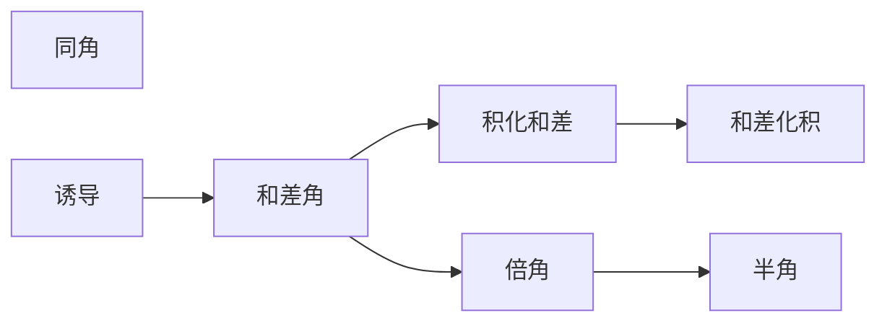

推导顺序


$$
\begin{align}
sin\alpha=cos(\frac{\pi}{2}-\alpha)\tag{I}\\
cos\alpha=sin(\frac{\pi}{2}-\alpha)\tag{II} \\
sec\alpha=csc(\frac{\pi}{2}+\alpha)\tag{III}\\
csc\alpha=sec(\frac{\pi}{2}+\alpha)\tag{IV} \\
\end{align}
$$
# 同角公式

```tikz
\usepackage{tikz}
\begin{document}
\begin{tikzpicture}[scale=2]
\draw[help lines](0,0) grid (5,5);
\draw (5,0) arc (0:90:5);
\draw (0,0)--(5,0);
\draw (0,0)--(3.54,3.54)[color=red];
\draw [dashed](3.54,3.54)--(3.54,0)[color=blue];
\draw (0,0)--(3.54,0)[color=green];
\draw (0,0)--(0,5);
\draw (0.5,0.5) parabola (0.6,0);
\node[scale=2] (1) at (1,3) {$tan\alpha=\frac{sin\alpha}{cos\alpha}$};
\node [scale=2] (2) at(4,2) {$sin\alpha$};
\node [scale=2] (3) at(2,0.2) {$cos\alpha$};
\node (4) at(4,4) {$P=(cos\alpha,sin\alpha$)};
\node[scale=2] at(-0.3,0) {A};
\node[scale=2] at(5.3,0) {C};
\node[scale=2] at(4,3.5) {B};
\node[scale=1.4] at(4.3,1) {opposite a};
\node[scale=1.4] at(2,-0.2) {adjacent b};
\node[scale=1.4] at(1,2) {hypotenuse c};
\end{tikzpicture} 
\end{document}
```

| 缩写  | 表达式 |
| --- | --- |
| sin | a/c |
| cos | b/c |
| tan | a/b |

$$
\begin{align}
sin^2\alpha+cos^2\alpha&=1 \\
\frac{1}{sin\alpha}&=csc\alpha \\
\frac{1}{cos\alpha}&=sec\alpha \\
tan\alpha&=\frac{sin\alpha}{cos\alpha} \\
cot\alpha&=\frac{1}{tan\alpha}=\frac{cos\alpha}{sin\alpha} \\
csc^2\alpha&=\frac{1}{sin^2\alpha}=\frac{sin^2\alpha+cos^2\alpha}{sin^2\alpha}=1+cot^2\alpha\\ 
sec^2\alpha&=\frac{1}{cos^2\alpha}=\frac{sin^2\alpha+cos^2\alpha}{cos^2\alpha}=1+tan^2\alpha
\end{align}
$$

# 诱导公式

奇变偶不变，符号看象限
$$
\frac{\pi}{2}\cdot N \pm\alpha
$$
N是奇数的时候$cos\Longleftrightarrow sin,tan\Longleftrightarrow cot$，偶数不变，具体符号依据变化前的角度象限

```tikz
\usepackage{tikz}
\begin{document}
\begin{tikzpicture}
\draw [shift={(-12,0)}] circle(2);
\draw [shift={(-8,0)}] circle(2);
\draw [shift={(-4,0)}] circle(2);
\draw (-15,0)--(-1,0);
\draw (-4,-2.5)--(-4,2.5);
\draw (-8,-2.5)--(-8,2.5);
\draw (-12,-2.5)--(-12,2.5);

\node[scale=2] (1)at(-12.7,0.7){+};
\node[scale=2] (1)at(-12.7,-0.7){-};
\node[scale=2] (1)at(-11.3,0.7){+};
\node[scale=2] (1)at(-11.3,-0.7){-};

\node[scale=2] (1)at(-8.7,0.7){-};
\node[scale=2] (1)at(-8.7,-0.7){-};
\node[scale=2] (1)at(-7.3,0.7){+};
\node[scale=2] (1)at(-7.3,-0.7){+};

\node[scale=2] (1)at(-4.7,0.7){-};
\node[scale=2] (1)at(-4.7,-0.7){+};
\node[scale=2] (1)at(-3.3,0.7){+};
\node[scale=2] (1)at(-3.3,-0.7){-};
\node[scale=2] at(-4,-2.7){$cot\alpha~\&~tan\alpha$};
\node[scale=2] at(-8,-2.7){$cos\alpha$};
\node[scale=2] at(-12,-2.7){$sin\alpha$};
\end{tikzpicture} 
\end{document}
```

# 圆心角定理

定理：**同圆和等圆中**，相等的圆心角所对应的：弧度=弦=弦心距

```tikz
\usepackage{tikz}
\begin{document}
\begin{tikzpicture}
\draw (0,0) circle (5);
\draw(-5.5,0)--(5.5,0);
\draw(-5.5,0)--(5.5,0);
\draw(0,-5.5)--(0,5.5);
\draw(-2,4.6)--(5,0);
\draw(3.56,3.56)--(2,-4.6);

\draw(0,0)--(3.56,3.56);
\draw(0,0)--(-2,4.6);
\draw(0,0)--(2,-4.6);

\draw (0.5,0.5) parabola (0.6,0);%角度
\draw (-0.4,1) parabola bend(0.2,1.2)(0.7,0.7);
\draw (0.53,-1.2) parabola (1,0) ;

\node[scale=2] (1) at(1,0.3){$\alpha$};
\node[scale=2] (1) at(0.3,1.7){$\beta$};
\node[scale=2] (1) at(1,-1.4){$\beta$};
\node[scale=2] (1) at(-2,5){$C$};
\node[scale=2] (1) at(4,4){$B$};
\node[scale=2] (1) at(5.5,0.5){$A$};
\node[scale=2] (1) at(2,-5){$D$};
\end{tikzpicture} 
\end{document}
```

此处设
$P_A=(1,0)$
$P_B=(cos\alpha ,sin\alpha)$
$P_C=(cos(\alpha+\beta),sin(\alpha+\beta))$
$P_D=(cos(-\beta),sin(-\beta))=(cos\beta,-sin\beta)$

根据定理
$$
\begin{align}
AC&=BD \\
AC^2&=(1-cos(\alpha+\beta))^2+(0-sin(\alpha+\beta))^2 \\ 
&=1-2cos(\alpha+\beta)+cos^2(\alpha+\beta)+sin^2(\alpha+\beta) \\
&=2-2cos(\alpha+\beta) \\
BD^2&=(cos\alpha-cos\beta)^2+(sin\alpha+sin\beta)^2 \\
&=cos^2\alpha+cos^2\beta-2cos\alpha cos\beta+sin^2\alpha+sin^2\beta+2sin\alpha sin\beta \\
&=2-2cos\alpha cos\beta+2sin\alpha sin\beta \\
&2-2cos(\alpha+\beta)=2-2cos\alpha cos\beta+2sin\alpha sin\beta \\
&~~-2cos(\alpha+\beta)=~~-2cos\alpha cos\beta+2sin\alpha sin\beta \\
&~~~~~~~~~cos(\alpha+\beta)=~~~~~~~~~cos\alpha cos\beta-~~sin\alpha sin\beta
\end{align}
$$

# 和差角公式
$$
\begin{align}
cos(\alpha+\beta)&=cos\alpha cos\beta-sin\alpha sin\beta\tag{1} \\\\
cos(\alpha-\beta)&=cos(\alpha+(-\beta))=cos\alpha\cos\beta+sin\alpha sin\beta \tag{2}\\\\
sin(\alpha+\beta)&=cos(\frac{\pi}{2}-(\alpha+\beta)) \tag{3}\\
&= cos((\frac{\pi}{2}-\alpha)-\beta) \\
&=cos(\frac{\pi}{2}-\alpha)cos\beta+sin(\frac{\pi}{2}-\alpha)sin\beta \tag{refer 2}\\
&=sin\alpha cos\beta+cos\alpha sin\beta\tag{refer I\&II} \\\\
sin(\alpha-\beta)&=cos(\frac{\pi}{2}-(\alpha-\beta)) \tag{4}\\
&=sin\alpha cos(-\beta)+cos\alpha sin(-\beta)\tag{refer 3} \\
&=sin\alpha cos\beta-cos\alpha sin\beta \\
\end{align}
$$
$$
\begin{align}
tan(\alpha+\beta)&=\frac{sin(\alpha+\beta)}{cos(\alpha+\beta)} \tag{5}\\
&= \frac{sin\alpha cos\beta+cos\alpha sin\beta}{cos\alpha cos\beta-sin\alpha sin\beta} \tag{refer1\&3}\\
&=\frac{tan\alpha+tan\beta}{1-tan\alpha tan\beta}\tag{同除$cos\alpha cos\beta$}\\
tan(\alpha-\beta)&=\frac{sin(\alpha-\beta)}{cos(\alpha-\beta)} \tag{6}\\
&=\frac{tan\alpha-tan\beta}{1+tan\alpha tan\beta}\tag{refer 5}
\end{align}
$$

# 积化和差公式

$$
\begin{align}
&\text{reference 1+2}:\\ 
&cos(\alpha+\beta)+cos(\alpha-\beta)=2cos\alpha cos\beta \Longrightarrow cos\alpha cos\beta=\frac{1}{2}(cos(\alpha+\beta)+cos(\alpha-\beta))\\\\
&\text{reference 1-2}:\\ 
&cos(\alpha+\beta)-cos(\alpha-\beta)=-2sin\alpha sin\beta \Longrightarrow sin\alpha sin\beta=-\frac{1}{2}(cos(\alpha+\beta)-cos(\alpha-\beta)) \\\\
&\text{reference 3+4}:\\ 
&sin(\alpha+\beta)+sin(\alpha-\beta)=2sin\alpha cos\beta \Longrightarrow sin\alpha cos\beta=\frac{1}{2}(sin(\alpha+\beta)+sin(\alpha-\beta))\\
\end{align}
$$

# 和差化积公式

$$
\begin{align}
A&=\alpha+\beta \\
B&=\alpha-\beta \\
\alpha&=\frac{A+B}{2}\\
\beta&=\frac{A-B}{2}
\end{align}
$$
$$
\begin{align}
cosA+cosB&=cos(\alpha+\beta)+cos(\alpha-\beta) \tag{7}\\
&=2cos\alpha cos\beta \tag{reference 1+2}\\
&=2cos(\frac{A+B}{2}) cos(\frac{A-B}{2})
\end{align}
$$$$
\begin{align}
cosA-cosB&=cos(\alpha+\beta)+cos(\alpha-\beta) \tag{8}\\
&=-2sin\alpha sin\beta \tag{reference 1-2}\\
&=-2sin(\frac{A+B}{2}) sin(\frac{A-B}{2})
\end{align}
$$
$$
\begin{align}
sinA+sinB&=sin(\alpha+\beta)+sin(\alpha-\beta) \tag{9}\\
&=2sin\alpha cos\beta \tag{reference 3+4}\\
&=2sin(\frac{A+B}{2}) cos(\frac{A-B}{2})
\end{align}
$$

# 倍角公式

$$
\begin{align}
cos(2\alpha)&=cos(\alpha+\alpha) \tag{10}\\
&=cos^2\alpha-sin^2\alpha \tag{refer 1}\\
&=cos^2\alpha-sin^2\alpha+sin^2\alpha-sin^2\alpha \\
&=1-2sin^2\alpha\\
or& \\
&=cos^2\alpha-sin^2\alpha-cos^2\alpha+cos^2\alpha \\
&=2cos^2\alpha-1
\end{align}
$$
$$
\begin{align}
sin(2\alpha)&=sin(\alpha+\alpha) \tag{11}\\
&=sin\alpha cos\alpha+cos\alpha sin\alpha \tag{rerfer 3}\\
&=2sin\alpha cos\alpha\end{align}
$$
$$
\begin{align}
tan(2\alpha)&= tan(\alpha+\alpha) \tag{12}\\
&=\frac{tan\alpha+tan\alpha}{1-tan\alpha tan\alpha}\tag{refer 5} \\
&=\frac{2tan\alpha}{1-tan^2\alpha} \\
\end{align}
$$

# 半角公式

$$
\begin{align}
cos(2\alpha)&=1-2sin^2\alpha \tag{13}\\ 
sin^2\alpha &=\frac{1-cos(2\alpha)}{2}\tag{refer 10}\\
sin\frac{\alpha}{2}&=\sqrt{\frac{1-cos\alpha}{2}}\\\\
 cos(2\alpha)&=2cos^2-1 \tag{14}\\
cos^2\alpha&=\frac{1+cos(2\alpha)}{2} \tag{refer 10} \\
cos\frac{\alpha}{2}&=\sqrt{\frac{1+cos\alpha}{2}}
\end{align}
$$
